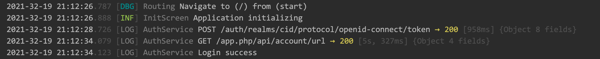

__Logecom__ is simple yet powerful and elegant middleware-based logging utility inspired by Nodejs Express library.



## Motivation

There are many logging libraries present with different approaches and interfaces. If you want to migrate from one logger to another, you must refactor lots of entry points in your application where
particular logger is initialized or used.

The idea is to abstract from logging process as much as possible and to define simple common interface with minimal overhead and give a stack to implement any logging pipeline with desired functionality in single place.

Basically there is the only interface introduced for any log processing: `LogTranslator`

By implementing it in different ways it is possible to achieve any result. You can transform, format, collect, print or send, and even use another logger! - anything you want inside the pipeline.

Implementing `LogTranslator` by `Logecom` itself makes it possible to create complex logs translation logic when one logger pipeline can be applied up to another (conditionally, for example) if needed ;)


## Features

There are several `LogTranslator` implementations available "out of the box" covering the most common logging use cases:
- `HttpFormatter` - Allows to log HTTP interaction easily
- `ConsoleTransport` - Default console printer. Provide simple and compact log entries formatting with different ways of printing: using `stdout`, `stderr`, `developer.log()` or `print()` methods

## Getting started

To start using Logecom logger first you need to configure a desired pipeline. By default there is no any configuration.  Typically in addition to simple textual events you would likely to want at least to find and format HTTP log entries and catch all unhandled errors. For Flutter application this configuration may look like this:

```dart
void main() {
  final method = PrintingMethod.stdErr;

  // typical logging pipeline
  Logecom.configure()
      .use(HttpFormatter(
        printRpcContent: config.logPrintRpcContent,
        hideAuthData: config.logHideAuthData,
        colorize: method == PrintingMethod.stdErr || method == PrintingMethod.stdOut,
      ))
      .use(ConsoleTransport(
        config: ConsoleTransportConfig(
          printingMethod: method,
          timestampFormat: method == PrintingMethod.print ? '' : 'yyyy-mm-dd HH:MM:ss.S',
        ),
      ));

  // this logger us used to specify uncategorized (Global) events
  final logger = Logecom.createLogger('Global');

  FlutterError.onError = (FlutterErrorDetails details) {
    logger.error('Flutter Error', [details.exception, details.stack]);
  };

  void onUnhandledException(Object error, StackTrace stack) {
    logger.error('Unhandled Exception', [error, '\n$stack']);
  }

  /// all application code must be inside this function
  /// to handle ALL errors properly
  void bootstrap() {
    // [AppView] is your application entry widget
    runApp(AppView());
  }

  runZonedGuarded(bootstrap, onUnhandledException);  
}
```

## Usage

To use common logging API you need to create a specific Logger instance with desired category using `Logecom.createLogger()` factory method. Category usually specifies the events source. A good practice would be to use current class or package name for this purpose.

```dart
class AppViewState extends State<AppView> {
  // it is possible to pass class type or any string desired
  final logger = Logecom.createLogger(AppView);

  @override
  void initState() {
    super.initState();
    // use logger instance to log events
    logger.log('State initialized');
  }
}
```

Using default `ConsoleTransport` the code above will print this:
```
2021-06-19 22:12:43.326 [LOG] AppView State initialized
```

> NOTE: If you DO NOT see any logs:
> Check that correct `printingMethod` is set to `ConsoleTransportConfig`. Not all printing methods are possible to use in all environments. For example, you will NOT see any logs if you set `PrintingMethod.stdErr` for Flutter application that runs inside the iPhone Simulator! This is a known issue. Please refer to `PrintingMethod` inline documentation for more details.

## Log Dio HTTP requests 

Dio is a popular HTTP client library available in pub.dev. To log its requests you can use `Interceptor` implementation like this:

```dart
import 'package:dio/dio.dart';
import 'package:logecom/logecom.dart';

class DioLogInterceptor extends Interceptor {
  DioLogInterceptor(this._logger);

  final Logger _logger;
  final _requestStartTime = Map<RequestOptions, DateTime>();

  @override
  void onRequest(RequestOptions options, RequestInterceptorHandler handler) {
    _requestStartTime[options] = DateTime.now();
    handler.next(options);
  }

  @override
  void onError(DioError err, ErrorInterceptorHandler handler) {
    final startTime = _requestStartTime[err.requestOptions] ?? DateTime.now();
    _requestStartTime.remove(err.requestOptions);
    _logger.log(
      'HTTP',
      HttpLogContext(
        method: err.requestOptions.method,
        url: err.requestOptions.uri,
        statusCode: err.response?.statusCode ?? -1,
        statusMessage: err.response?.statusMessage ?? err.message,
        duration: DateTime.now().difference(startTime),
        responseData: err.response?.data,
        requestData: err.response?.requestOptions.data,
        headers: _getHeaders(err.requestOptions.headers),
      ),
    );
    handler.next(err);
  }

  @override
  void onResponse(Response response, ResponseInterceptorHandler handler) {
    final startTime = _requestStartTime[response.requestOptions] ?? DateTime.now();
    _requestStartTime.remove(response.requestOptions);
    _logger.log(
      'HTTP',
      HttpLogContext(
        method: response.requestOptions.method,
        url: response.requestOptions.uri,
        statusCode: response.statusCode ?? 0,
        statusMessage: response.statusMessage ?? '',
        duration: DateTime.now().difference(startTime),
        responseData: response.data,
        requestData: response.requestOptions.data,
        headers: _getHeaders(response.requestOptions.headers),
      ),
    );
    handler.next(response);
  }

  Map<String, String> _getHeaders(Map<String, dynamic> headers) {
    return headers.map((key, value) {
      if (value is String) {
        return MapEntry(key, value);
      } else if (value is List) {
        return MapEntry(key, value.join('; '));
      } else {
        return MapEntry(key, value.toString());
      }
    });
  }
}
```

Usage example is as follows:
```dart
class AuthService {
  AuthService() {
   client.interceptors.addAll([
     DioLogInterceptor(logger),
   ]);
  }

  final logger = Logecom.createLogger(AuthService);
  final client = Dio();
  ...
}
```

Enjoy ;)
